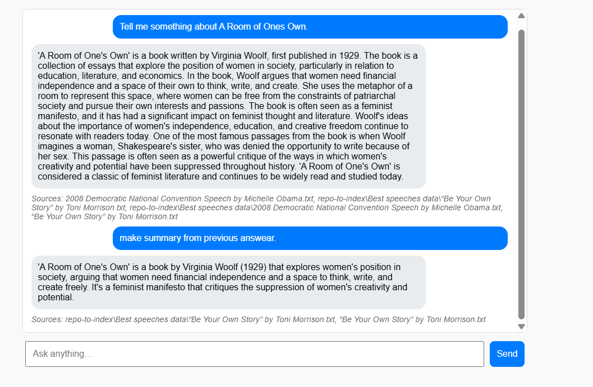

# Codebase GPT — Your Private Document & Codebase Chatbot (2025)

**Ask questions in plain English about any file in your project:**  
PDFs, Word, Excel, Python, JavaScript, Markdown, logs… everything is instantly searchable and remembered forever.

Built with **FastAPI + Groq (Llama 3.1) + LangChain 1.1 + Chroma + PostgreSQL**  
Fully Dockerized — runs anywhere in seconds.



## Features

| Feature                        | Status | Description |
|-------------------------------|--------|-----------|
| Chat with any document/code   | Done | PDF, DOCX, XLSX, TXT, .py, .js, .md, .log … |
| Persistent conversation memory| Done | Postgres-backed — survives restarts |
| Drag & drop file upload → auto-indexing | Done | No terminal needed |
| Real-time sources shown       | Done | See exactly which file(s) the answer came from |
| Zero-config Docker setup      | Done | `docker compose up` and you’re live |
| Model caching                 | Done | First start ~20 s, then < 3 s startup forever |
| Works offline (after first download) | Done | Only Groq API key needed |

## Quick Start (Docker — recommended)

```bash
# 1. Clone
git clone https://github.com/yourname/Codebase-GPT.git
cd Codebase-GPT

# 2. Put your Groq key in .env, create your own at https://groq.com/
echo "GROQ_API_KEY=gsk_your_key_here" > .env

# 3. Start everything
docker compose up --build
```

Open → http://127.0.0.1:8000

Drop files → ask anything → enjoy!


## Project Structure

```
Codebase-GPT/
├── app/
│   ├── templates/index.html    # beautiful chat UI
│   ├── main.py                 # FastAPI + RAG logic
│   ├── ingest.py               # File indexing script
│   └── requirements.txt
├── repo-to-index/              # ← DROP YOUR FILES HERE
├── data/chroma_db/             # ← vector database (auto-created)
├── models/                     # ← cached HuggingFace models
├── Dockerfile
├── docker-compose.yml
└── .env                        # your Groq key

```

## Technical Documentation

### Stack (2025)

| Layer               | Technology                                 |
|---------------------|--------------------------------------------|
| Web Framework       | FastAPI + Uvicorn                          |
| LLM                 | Groq (Llama 3.1 8B or 70B)                 |
| Embeddings         | `sentence-transformers/all-MiniLM-L6-v2`   |
| Vector Store        | Chroma (langchain-chroma)                  |
| Document Loaders    | Unstructured (PDF/DOCX/Excel) + TextLoader |
| Memory              | PostgreSQL + SQLChatMessageHistory         |
| Frontend            | Pure HTML + jQuery (no React/Vue needed)   |

### Why this stack?

- **Speed**: Groq is the fastest inference provider in 2025
- **Cost**: Free tier is generous, paid is cheap
- **Privacy**: All your files stay on your machine / server
- **Simplicity**: Zero JavaScript framework → easy to customize

## How to Add More Files

### Option 1 — Drag & drop in browser (easiest)
Just use the upload area at the top of the web page.

### Option 2 — Drop files manually
```bash
# Put files here
cp your-file.pdf repo-to-index/

# Re-index (takes seconds)
docker exec -it <container_name> python app/ingest.py
# or locally:
python app/ingest.py
```

## Contributing

We love contributions! Here’s how to help:

1. **Fork** the repo
2. Create your feature branch (`git checkout -b feature/amazing-idea`)
3. Commit (`git commit -m 'Add streaming responses'`)
4. Push and open a Pull Request

### Areas that need love

- Streaming token-by-token responses
- Dark mode toggle
- Chat export (JSON/Markdown)
- Authentication (OAuth2 / simple password)
- Support for images in PDFs (OCR)
- Better Excel table rendering

All contributions are welcome — even tiny fixes!

## License

MIT License — do whatever you want with it.

---

Made with love by developers who were tired of Ctrl+F-ing through 50 files every day.

Enjoy your private, lightning-fast, always-remembering document assistant!